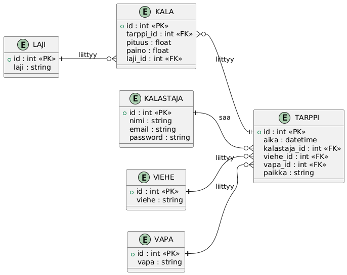

# Kalasaaliiden Tallennusnettisivu – raportti

## Johdanto

Tämän projektin tavoitteena oli toteuttaa kalasaaliiden tallennukseen tarkoitettu nettisivu, jossa käyttäjät voivat lisätä ja tarkastella kalastustietoja. Projektin avulla harjoittelin ohjelmointia, tietokantoja ja web-kehitystä.
---

# Projektin tavoite

Projektin tavoitteena oli tehdä toimiva nettisivu kalasaaliiden tallentamiseen ja hallintaan. Nettisivun avulla käyttäjät voivat:

* rekisteröityä
* kirjautua sisään
* lisätä kalasaaliita
* tarkastella omia tallennettuja kalatietoja

Projektin tarkoituksena oli samalla harjoitella frontendin, backendin ja tietokantojen käyttöä yhdessä.

---

# Käytetyt teknologiat

Projektissa käytettiin seuraavia teknologioita:

* PHP frontendin toteutukseen
* MySQL tietokantaan
* Python backendin toteutukseen
* Tkinter Python-pohjaisen käyttöliittymän tekemiseen
* XAMPP paikallisen palvelinympäristön käyttämiseen

---

# Tietokanta

Tietokanta suunniteltiin kalasaaliiden tallennukseen. Tietokannassa on omat taulut:

* tarpeille
* käyttäjille
* kaloille
* kalalajeille
* vieheille
* vavoille

Tietokannan relaatiot mahdollistavat tietojen yhdistämisen ja hakemisen tehokkaasti.

## Tietokantarakenne

* KALASTAJA → käyttäjätiedot
* TARPPI → yksi saatu kala / tapahtuma
* KALA → kalan tiedot
* LAJI → kala lajit
* VIEHE → vieheet
* VAPA → vavat

---

# Ohjelman rakenne

## Frontend

Frontend toteutettiin PHP:lla. Frontendissä käyttäjä voi:

* rekisteröityä
* kirjautua
* lisätä saaliita
* tarkastella tietoja

## Backend

Backend toteutettiin Pythonilla ja Tkinterillä. Backendin tarkoituksena on ylläpitää tietokannan sisältöä.

Backendissä voidaan esimerkiksi:

* poistaa käyttäjiä
* poistaa vieheitä
* poistaa vapoja
* poistaa kalalajeja

---

# Tietoturva

Projektissa huomioitiin perustason tietoturva:

* käyttäjien salasanat tallennetaan password_hash()-hashattuina
* SQL-injektioita estetään prepared statementien avulla

---

# Mikä onnistui

Frontend onnistui hyvin. Käyttöliittymästä tuli toimiva ja käyttäjä pystyy lisäämään sekä tarkastelemaan kalasaaliita helposti.
Tietokannan rakenne onnistui myös hyvin ja eri taulujen väliset suhteet toimivat suunnitellusti.

---

# Mitä tekisin paremmin/kehitys ideoita tulevaisuudelle

Jos jatkan projektia tulevaisuudessa, toteutan backendin Flaskilla Tkinterin sijaan. Flask sopii paremmin web-pohjaiseen sovellukseen ja helpottaa backendin laajentamista tulevaisuudessa.
Parantaa tietoturvaa frondendissä.

---

# Mitä opin

Projektin aikana opin lisää:

* PHP-ohjelmoinnista
* Python-ohjelmoinnista
* Tietokantojen käytöstä ja tekemisestä

Opin myös käyttämään prepared statementteja sekä salasanojen turvallista hashäystä.

---

# Yhteenveto

Projektissa toteutettiin toimiva kalasaaliiden tallennusnettisivu käyttäen PHP:tä, Pythonia ja MySQL-tietokantaa. Projekti kehitti osaamistani erityisesti web-kehityksessä, tietokannoissa ja ohjelmistojen rakenteen suunnittelussa.
